# Semi-Supervised Machine Learning Research

## Core ideas

- **Must**: Unsupervised data will only enhance the prediction, if the distribuition of *p(x)* has relation with *p(y|x)*.

There are many SSL algorithms, and one should use the methods whose assumptions best fit the problem at hand.

- **Smoothness assumption**: If *x_i* is close to *x_j*, then *y_i* should be == *y_j*.
- **Low-density assumption**: *Decision boundary* should not pass through high density locations.
- **Manifold assumption**: The data lies on several low-dimensional *manifold*. Points in the same *manifold* should have the same label.
- **Cluster assumption**: Points in the same *cluster* should have the same label.

- "if the data points (both unlabeled and labeled) cannot be meaningfully clustered, it is impossible for a semi-supervised learning method to improve on a supervised learning method."
- "potential performance degradation is particularly relevant in scenarios where good performance can be achieved with purely supervised classifiers".
- "To provide a realistic evaluation of semi-supervised learning algorithms, researchers should thus evaluate their algorithms on a diverse suite of data sets with different quantities of labeled and unlabeled data."

- KEEL software package for semi-supervised learning. Sickit-learn has some modules as well. It is also easy to implement semi-supervised loss terms within neural networks that come from PyTorch or TensorFlow.

- **Inductive**: Inductive methods are originated to ceate a classifier, that not only predicts labels for the unlabeled data X_u, but also originates a model that can be used for any unseen data.

- **Transductive**: Any transductive algorithm's goal is to predict labels for the unlabeled data in the current dataset, nothing else. They are mostly graph based and strongly based on the manifold assumption. Three steps are required to create these graphs, Graph Construction, Weighting and Inference.

## Inductive methods

### Wrapper methods OR Proxy-label methods

Models are trained with the existing labeled dataset X_l to predict the unlabeled data X_u.

- **Self-training**: These models increase the training data by using existing labeled data to predict unlabeled data.
The models ouput for X_u, Y^_u, is in the form of a probability distribution over the classes C. If the argmax(y^_u) is higher than a threshold, x_u is assigned that label and include into D_l as pseudo-labeled data. The model repeats the process until D_u is empty, or there are no more X_u with predictions higher than the threshold.
Several adjustements can be made to diverse the classifiers, such as the selection of the pseudo-labels to be included into the training data (prediction confidence), the reutilization of data, and the stopping condition.
These models are unabeled to correct their own mistakes, thus any wrong pseudo-label would be taken as correct.
  
  - **EntMin**: Entropy minimization encourages the model to make low-entropy predictions for X_u. It prevents the decision boundary to be placed on high-density regions.

  - **Pseudo-label**: The model is trained on X_l with a *cross-entropy loss*. Then it fetches a batch of X_u and adds the most confident y_u data point, as a pseudo-labeled instance, into X_l.

  

  -**Noisy Student**: Composed of two NN, firstly the Teacher *EfficientNet* model is trained with X_l and predicts pseudo-labels. Then, a second model bigger *EfficientNet* Student model is trained on augmented combinations of labeled and pseudo-labeled data, using *RandAugment* and *dropout*. Then the student model becomes the teacher, and the process is repeated.

  

  - **S^4L**: Learns useful representations from image databases. Loss is calculated through the predictions made from rotated images.

  
  
  - **Meta Pseudo Labels**: Designs a Teacher model that assigns distributions to input examples to train the Student model. Teacher observes Student's training performance with a validation set, and learns to generate target distributions from which, when trained with, the Student gets good performance.
  Student updates its wieghts with (x, T(x)).

  

  - **EnAET**: Integrates an ensemble of spatial and non-spatial transformations to self-train a good feature representation. There are 4 spatial transformations: *Projective, Affine, Similarity and Euclidean*. Learns an encoder on original instance and its transformations. Decoder learns to estimate from input transformations.

  

  - **SimCLRv2**: Sumarized by three steps: unsupervised/self-supervised pre-training, supervised fine-tuning on 1%/10% labeled samples, and sel-training with task-specific unlabeled examples.

  

- **Multi-view**: Two or more classifiers are trained on distinct views, or limited amounts, of the data. Then predict some unlabeled data, and append their most cofident predictions to the training dataset of the other classifier.
Multi-view assumes that each view is enough to accurately predict a label, and both are complementary.
  
  - **Co-training**: The classifiers are trained with a different subset of features (views). x_u is predicted from one model and added to the other one if y^_u > threshold. For it to work, both views v1(X) and v2(X) must be able to represent the data; and it has to follow the condition *p(v1(x) | v2(x), c) = p(v1(x) | c)*.

  
  
  - **Tri-training**: Uses three independently models (f1, f2, f3) trained with X_l. A random x_u is added to training set of one fi, if the other two f's agree on the y^_u. Training stops when no more x_u are being added to X_l.

    - **Tri-Net**: Three different classifiers learn from three separated labeled datasets with *Bootstrap sampling*.
    X_l is induced with *output smearing* noise to create them. The three models predict y^_u, and if two agree, (x_u, y^_u) goes to the X_l of the other classifier.

    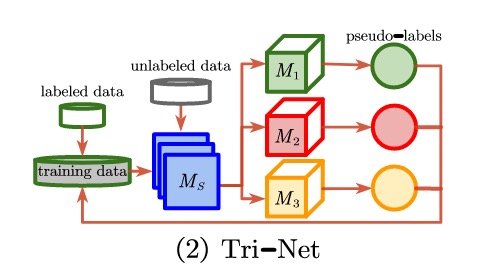

    - **Cross-View Training**: Model is trained to predict consistent predictions from different views of inputs. Inspired on *self-training*, a shared encoder substitutes teacher and student, and other models transform encoded data into predictions. These models are *auxiliarity student models* and *primary teacher model*. Each student is fed with a different view of x_u. Teacher is trained on D_l, and generates the pseudo-labels. For an encoder *e*, a teacher *t*, and *K* student models *s*, the training objective is as follows:
    
    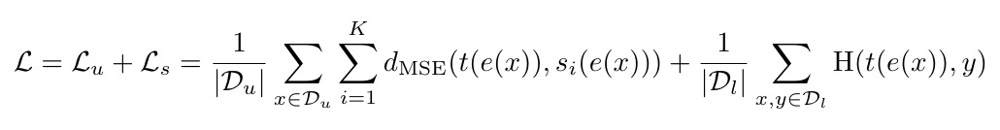
    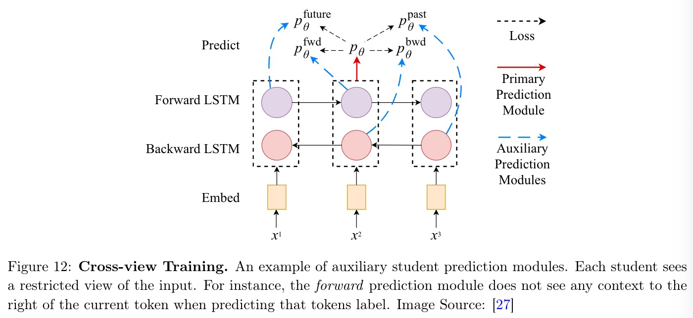

- **Boosting**: Ensemble architectures return the overall prediction of k different classifiers trained independently.
In *bagging*, the models are trained with l uniformly picked datapoints from the dataset (bootstrapping). The result comes from the aggregation of all predictions.
On the other hand, with *boosting*, each model is trained following a sequence, where they receive the full dataset with weights for each datapoint. These weights correspond to the performance of all the previous models.
  
  - **SSMBoost** boosting algorithm adapted for SSL, where the weighted errors include the unlabeled data.

  - **ASSEMBLE** algorithm pseudo-labels the data and uses it for the next classifier.

  - **SemiBoost** algorithm that is based on 3 assumptions. The predicted labels of nearby unlabeled data should be consistent, with the labels of close labeled data, and accurate.

### Unsupervised preprocessing

Inductive methods that utilize the labeled and unlabeled data in two seperate steps. Tipically, the unlabeled data is utilized in feature extraction, clustering of data, or calculating initialization weight values.

- **Feature extraction**: Feature extraction is an unsupervised techinique used to transform the input data and increase the models performance. Autoencoders are a extremely used example of architecture that uses feature extraction. They calculate a feature vector from which they can represent all the datapoints.

- **Cluster-then-label**: Algorithms that cluster the data and use the clusters to guide the classification process.

- **Pre-training**: Applied to deep learning methods, it uses unlabeled data to guide the decision boundary torwards interesting regions. Deep learning algs that use it: *deeb belief networks*; *stacked autoencoders*.

### Intrinsically semi-supervised methods

Describes supervised models that suffer some changes on their objective functions to include unlabeled data.
In another words, extends supervised models to include the unlabeled data into the decision parameters.

- **Maximum-margin methods**: Algorithms that intend to maximize the distance between given data points and the decision boundary.

  - **Support vector machines**: Discovers a boundary that maximizes the margin, which is the distance between the datapoints in all classes. For semi-supervised problems, this algorithm (*S3VMs*) additionally tries to minimize the number of unlabeled data that violates the margin. These algs become non-convex and NP-hard. Optimized in *TSVM*.

  - **Gaussian processes**: Creates a model that maps all datapoints to continuous values inside [-1, 1]. The mapping function is then applied to all unlabeled data.

  - **Density regularization**: Labels should not change where p(x) is high. Add information values I(x, y) before the decision margin process. I() is low when labels are similar.

- **Peturbation-based methods OR Consistency regularization**: The core idea of these models is that the output of the model remains unchanged when data is under realistic perturbations.
Add noisy datapoints, which should have labels similiar to close labeled data (Smoothness assumption). Semi-supervised neural networks which add unlabeled data into the training step. Their objective is to minimize the distance between the two labels for x_i and x~_i (disturbed version of x_i). Min(d(f(x), f(x~))).
Frequently, the distance functions are the *Mean squared error*, *Kullbacl-Leiber divergence (KL)* and *Jensen-Shannon divergence (JS)*

  - **Ladder networks**: Noise injected into all hidden layers of the encoder. Another encoder also receives the same datapoint, but has no noise inputation, and outputs a label. The mapping function is shared between encoders. Decoder is constantly calculating the difference between z^_i and z_i.
  
  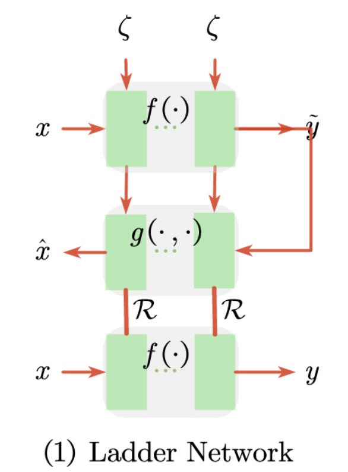

  - **π-model**: Both X_l and X_u are treated equally. They are fed into two different NN with divergent augmentations and a final dropout. the model expects the two predictions to be as consistent as possible.
  
  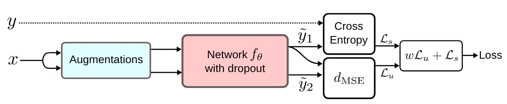

  - **Temporal ensembling**: π-model optimization, where it only needs 1 forward pass during training, by leveraging the *Exponential Moving Average* of past epoch predictions. Zi is updated with epochs output
  
  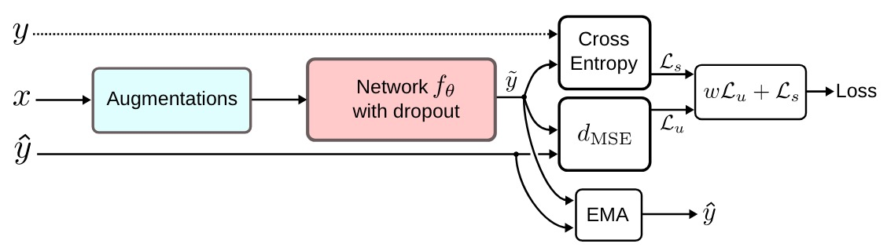

  - **Mean teacher**: Framework with two models, Student and Teacher. Both receive X_u. Both are noise inputed, but with different noise functions. Student is similar to π-model, however, even though the Teacher has the same architecture, it's weights are calculated through an EMA.
  
  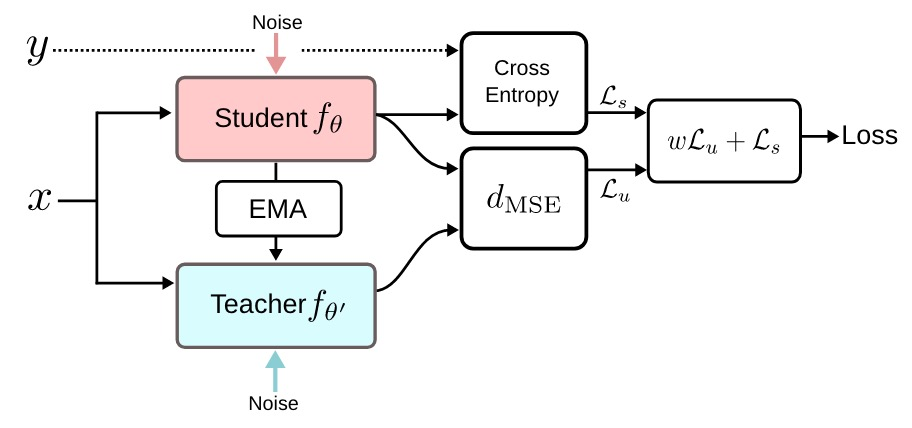

  - **Virtual adversarial training**: Used to give more robustness around input data and noise. Assign to each input data the label of the neighbours in adversial direction (direction in input space which label probability of the model is most sensitive). Model trained for output distribuition to be identically smooth around each data point. For every x, compute a perturbation that would highly alter the prediction.
  Used to find the optimal adversarial perturbation of a real input point x.
  
  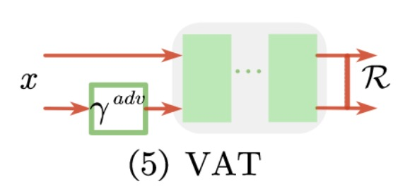
  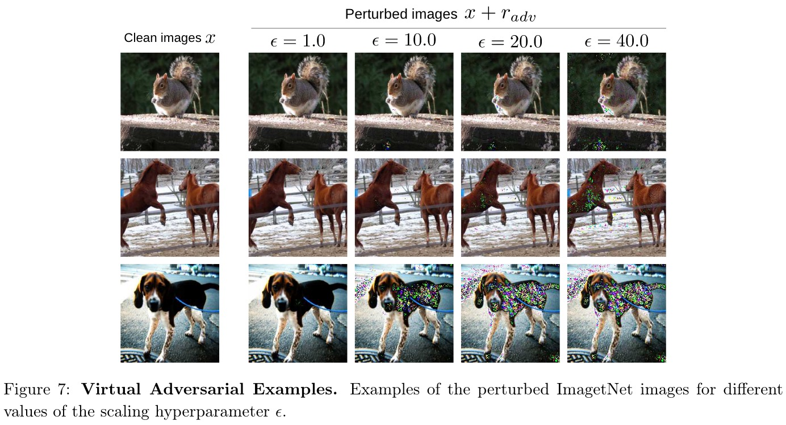

  - **Dual students**: Two students with diff weights are simultaneously trained. At a given iteration, one student gives targets to the other. The most stable student gives the targets => f(x) = f(x~) and f(x) > threshold.

  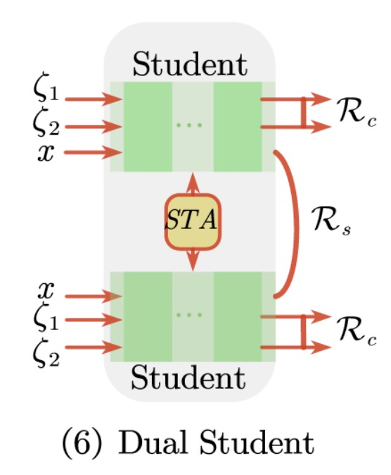

  - **Fast-SWA**: π-model and mean teacher keep having big updates on weights after training is over. With *Stochastic weight averaging* one can reach final weight values closed to the center of the falt region of weights.
  
  
  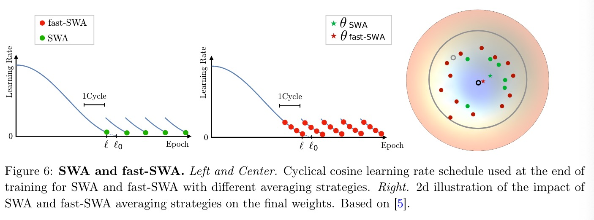

  - **Virtual Adversarial Dropout**: Finds the dropouts that have the biggest impacts on the model's predictions. Starts with a random dorpout mask, but it is restricted to a certain difference of the adversarial dropout mask. Keeps updating the adversarial droupout mask with a KL-divergence loss between the outputs.

  - **WCP**: Worse-case Perturbation. Enhances the most vulnerable part of a network by making the most resilient weights and connections against the worst-case perturbations. It enforces an additive noise, and dropouts some network connections.

  

  - **UDA** Unsupervised Data Augmentation investigates the role of noise injection in consistency training. Additionaly, it utilizes high-quality data augmentation methods. It intends to minimize the distance between f(teta, x) and f(teta, x, Augm).

  

  

  - **Interpolation Consistency Training**: Random perturbations inefficient in high dimensions.  VAT and AdD rely on multiple forward and backward passes to compute the perturbations that would maximize the model's predictions. Given a MixUp function that outputs an interpolation between two x, the model trains a function f to provide consistent predictions for several random points interpolated between unlabeled x_i and x_j, which are labeled by a teacher model from f' (EMA of f).
  
  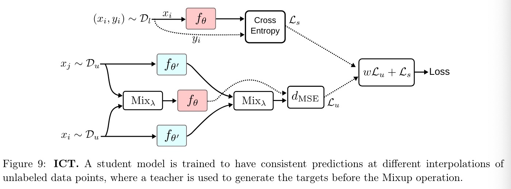

  - **Unsupervised Data Augmentation**: Models that rely on data augmentation techniques to create x~. These techniques create a diverse set of data more realistic than using noise imputation from distribution functions. *RandAugment* for image classification and *Back-translation* for text classification.

- **Manifolds**: Takes for granted the manifold assumption. The input space is a composition of many subspaces of lower dimention, and datapoints in the same subspace share the same label.
Thus, unlabeled datapoints possess the labels of datapoints in their manifold.

- **Generative models**: Models implemented to output a process to generate new valid data. They output newly created data, not labels.

  - **Variational autoencoders**: Composed of a encoder and a decoder, which creates data from input and the other reconstructs the input from the data. Learns by minimizing the difference between both. From X, the dist modeled by the encoder q(z|x), the gaussian dist p(z) and the reconstrucetd data X^ from the decoder p(x|z), we can write the lost function as follows:
  
  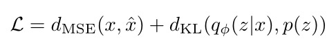

    - **Latent-feature discriminative model (M1 model)**: Training made with X_l and X_u. X_l is then transformed into Z, where dim(Z) << dim(X_l). Supervised task solved with dataset=(Z, Y).

    

    - **Generative semi-supervised model (M2 model)**: Training done with X_l and X_u. q(y|x) from a network, q(z|y,x) from the encoder and p(x|y,z) from the decoder.
    This is the basic SSL VAE framework.

    

    - **Stacked enerative semi-supervised model (M1 + M2 model)**: Joining the two previous models. M1 trained to output Z, which are used by M2 as new representations of the data. The final model is described as:
    
    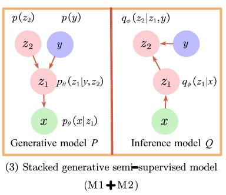

    - **ADGM**: Auxiliary deep generative model is a *Variational Autoencoder* with an auxiliary variable so the encoder q(z|x) is able to fit more complicated posteriors p(z|x). For it to work accordingly, it is a must that p(x, z, a) = p(a|x, z)p(x, z), with p(a|x, z) ≠ p(a). The model becomes: p(y)p(z)p(a|z, y, x)p(x|y, z).
    Introduces auxiliary variables.

    

    - **Infinite VAE**: Suits the input data by mixing coefficients by a Dirichlet process. Combines Gibbs sampling and variational inference. Combines the unsupervised generative model and a supervised discriminative model.
    Its a hybrid of several models to improve the performance.

    - **SDVAE**: Semi-supervised Disentagled VAE assumes that there are two seperated sets of variables. One are disentangled, whereas the other ones are not. Both are assumed to be independent.

    

    - **ReVAE**: Captures meaningful representations of data with a principled variational objective. Treats X_l as a know observation, and X_u as an additional variable.
    Introduces auxiliary variables.

    

  - **Generative adversarial networks (GAN)**: Composed by two neural networks, one generator G and another discriminator D. G receives a sample Z from a probability function p, which maps to X. D does not know from who, but it receives X or a an output from G, and outputs the probability of its origin.
  
  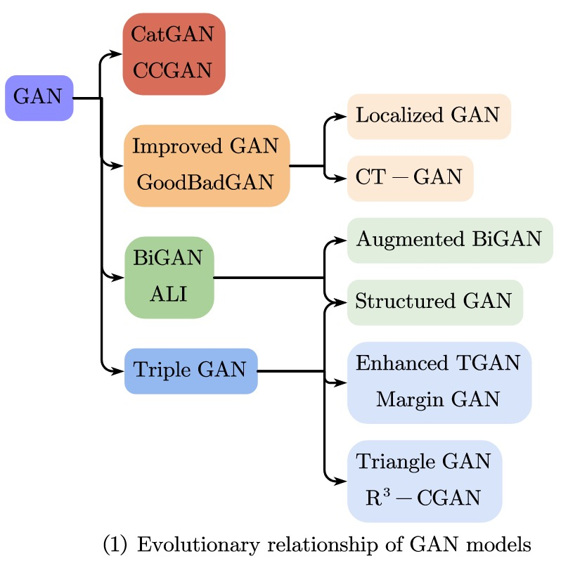
  
  Training a GAN involves optimizing a loss function of G and D as follows:
  
  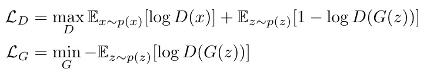
  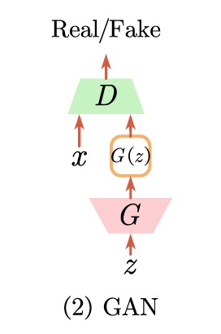

    - **CatGAN**: Categorical generative adversial networks is modified for D to output the probability of it's input to belong to one of C classes.
    Both D and G must fulfil some requirements. For D, it must be certain of the class c assigned to X, uncertain of those that come from G(p(Z)), and maintain the C distribution. When it comes to G, it must generate samples with clear class assignment, plus maintain p(X) distribution.
    
    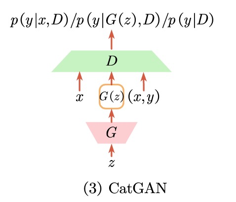

    - **GoodBadGAN**: Proposed after realizing that SSL Improved GANs cannot simultaneously have accurate Generators and Discriminators. Porpusely creates a Generator that outpust unrealistic data, as it increases the Discriminator's generalization.
    The bad Generator is learnt by adding a penalty term.
    
    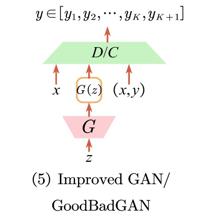

    - **Localized GAN**: Uses local coordinates from the input space to parameterize data.
    
    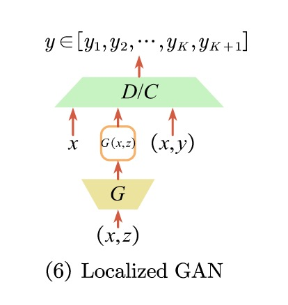

    - **CT-GAN**:
    
    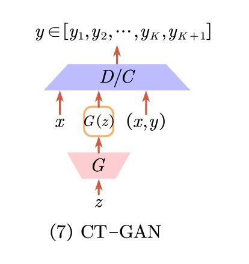

    - **BiGAN**: Bidirectional GAN adds another neural network called Encoder, which maps X to Z', therefore creating a pair (x, z') for each data point. Both this pair, and another pair obtained from the Generator are fed into the discrimiator D, which should distinguish the fake from the real.

    - **ALI**: Adversarially Learned Inference also uses three components. A generator G, an inference network E, and a discriminator D. G receives an encoded z and outputs to x' creating a pair (z, x'). E is fed with a normal data point x, which is then encoded to z', forming the data pair (x, z'). As all other discriminators, D has to distinguish the pairs.

    - **Augmented BiGAN**: Improved BiGAN to be used for SSL.
    
    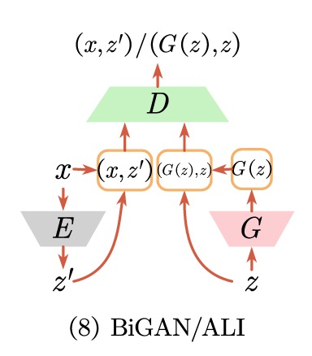

    - **Triple GAN**: Constructed to overcome the performance incompatibility of G and D. This model has three neural networks, a generator G, a classifier C, and a discriminator D. G receives a true label and outputs a fake sample (x', y). C receives real data and gives pseudo-labeled data (x, y'). Finally, D is fed with (x', y), (x, y') plus a real data point (x, y), and has to discover which one is the real pair.

    - **Enhanced TGAN**: Redesigns the G's loss function and the C's network.
    
    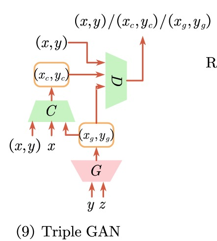

    - **MargiGAN**: Inspired by the Triple GAN, this framework is better for SSL classification. G tries to maximize the margin of generated samples, C to decrease margin of pseudo-labeled data, and D to distinguish real from fake data.

    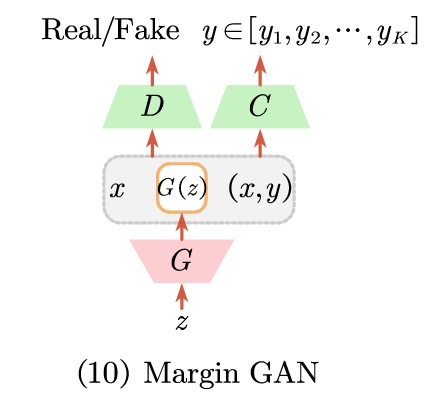

    - **Triangle GAN**: This model is an extention of BiGAN or ALI. It is made out of four different neural networks, a generator G, an encoder E, and two discriminators D1 and D2. G and E learn two different distributions. G generates fake data x', and E pseudo-labels x with y'. D1 receives a real data (x, y), a fake data (G(z), y) and tells which one is correct. Whereas, D2 is fed with a pseudo-label (x, y') and must discover if it was generated or not.

    

    - **Structured GAN**:

    

    - **DCGAN**: Deep convolutional GANs leverages unlabeled data to learn good and transferable intermediate representations, which can be used on SL tasks.

    - **SGAN**: Semi-supervised GAN is similar to GAn, but has some differences. D has C+1 outputs, where the +1 corresponds to a fake class, and when training, it uses label values if X comes from D_l.

    - **Feature Matching GAN**: GAN training procedure consists on both models, D and G, trying to minimize their loss function throguh gradient descent on each others costs simultaneously. So, there is no convergence guarantee. To assert convergence, G generates data that matches the feature statistics. The intermediate layer has the following objective:
    
    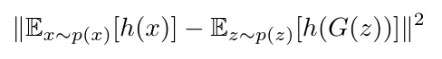
    
    D also outputs a C+1 objective, where the generated examples are considered to be the fake class. Loss function becomes:
    
    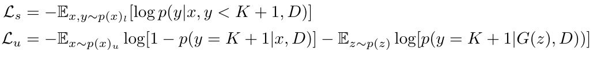

  - **Mixture models**: A model consisting of K gaussian distribuitions with importance weights (sum of all weights = 1). It could plot p(x|y) as a agreggate sum of all distribuitioins multiplyed by its weight value. The plotted probability can be used to label unlabeled data.

## Transductive methods

Contrary to the inductive methods, transductive algorithms only purpose is to label the unlabeled data of the dataset.
These methods are costly, and require to be entirely rerunned to classify a new set of unlabeled data, which is undesirable.

### GSSL

Transductive methods are mostly based on graphs, thus the name of this section.
Graph-based semi-supervised learning is divided in three steps: *graph creation*, *graph weighting* and *inference*. The first one creates the nodes with information from labeled and unlabeled data. Then its calculated a connection from N to N nodes, according to a similarity measure. Finally, during the inference step, the labels are propragated according to a function.

#### Graph embedding

Methods applied to represent full graphs or individual nodes in vector space.
Node embedding is used to create vectors that represent the node's position and neighbourhood.
There are two types of embedding algorithms, shallow embedding and deep embedding, where the second one uses deep learning algorithms. As deep learning progresses, GSSL focused on deep embedding, and these methods can either be *AutoEncoder-based methods* or *GNN-based methods*.

##### AutoEncoder-based methods

These methods create a vector s_i for each node i, which contains the i's similarity values with all other nodes in the graph. Therefore, it acts as a high-dimentional vector of i's representation on it's neighbourhood.
The loss function is as follows:

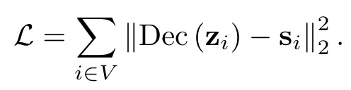
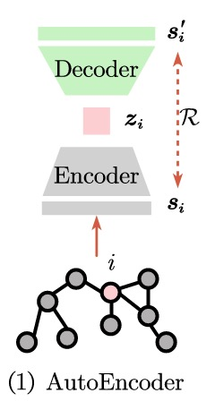

- **SDNE**: Structural Deep Network Embedding uses auto encoders to maintain the first and second-order network proximities.
It is composed of an unsupervised autoencoder that identifies an embedding for a node to rebuild it's neighbourhood, and a supervised part based on Eigenmaps that penalyzes related vertices that are distant to each other.

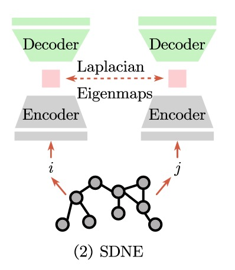

- **DNGR**: Made out of three components. Random surfing, positive pointwise mutual information calculation, and stacked denoising autoencoders.
Random surfing design creates a stochastic matrix, which is transformed into a PPMI and fed into a stacked denoising autoencoder to obtain the embedding.

##### GNN-based methods

Built to solve AutoEncoder-based methods, which solomnly represent a node i regarding it's neighbours, and discarding the whole graph.
Consists of two operations: aggregate and update.

- **Basic GNN**: The graph is represented as an adjacency matrix (A) and a feature matrix (X).
Each node's initial embedding is set to its corresponding feature vector H^0 = X.
The algorithm iteratively aggregates information from neighboring nodes to update each node's embedding.
The aggregation step combines information from neighbors, and the transformation step applies a linear transformation to the aggregated information.
After a certain number of iterations, the final node embeddings H^t are used as the representations of the nodes.

- **GCN**: Instead of summing the encoding states of neighbour nodes, which increases value to nodes with more neighbours, it normalizes the aggregation process regarding the central node degree.

- **GAT**: Graph Attention Network adds an attention mechanism, which influences the impact each neighbour has on the current node.

- **GraphSAGE**: Uses concatenation vectors or skips connections to overcome *over-smoothing*.

- **GGNN**: Adds a *RNN* to view the *GNN* message propagation algorithm.

#### Graph construction

Step that focuses on creating nodes and connecting them.

- **Adjency matrix construction**: Methods to create a matrix that represents and possesses all the weight values for each edge. W belongs to N x N. These methods can be local or global, where the first ones' node creation is independent of other nodes, whereas the second method optimizes a global function, so nodes far apart can influence each other's connectivity.
Graphs can be *fully connected* or *sparse*, where on the first one all edges have a value, and on the second one, nodes are only connected if they follow a rule.

  - **e-neighbourhood**: x_i is connected to x_j if distance(x_i, x_j) < e. Graph structure is highly dependent of e value and distance function. Bad choice when scale of patterns varies across the input data.

  - **k-nearest neigbours**: x_i is connected to all k x_j where the distance(x_i, x_j) is minimum. Does not create symmetric graphs. *symmetric k-nearest neighbours* x_i is connected to x_j if either of them belong to the other's neighbourhood. *mutual k-nearest neighbours* x_i is connected to x_j if x_i and x_j are both in each other's neighbourhood.
  Usually, all nodes do not have k neigbours, which negatively impacts the classifier.

  - **b-matching**: Ensures that all nodes have the same amount of neighbours, and have n pre-defined edges. Reached by minimizing AijxCij. Most efficient method for this alg is still O(n^2.5) and requires assumptions.

- **Tree-Based Bayes**: X_L and X_U are placed as leaf nodes of a tree T. Label at the root propagates down to leaves. Nodes sharing the same leaf, hihgly share the same label.

#### Inference

Process of creating predictions *Y^_u* for unlabeled data *X_u*.

- **Graph min-cut**: One node v+ and v- with infinite weight connected to all positive nodes and negative nodes, respectively. v+ is a *source node*, whereas v- is a *sink node*. The algorithm starts by removing all edges with a minimal combined weight, that impossibilitate a path from v+ to v-. From the remaining graph, the labels are propagated.
Only outputs lables, not probabilities of lables.

- **Markov random fields**: Graph models can be expressed as a Markov random field, by connecting random variables Y^_i to random variable Y´_i that can only obtain a true label y_i. Probability calculations can be made when the graph follows an expression.

- **Gaussian random fields**: The predicted label of unlabeled datapoints is equalt to the average of labels of all neighbouring points. Start by assigning a random label to an unlabeled datapoint, then propagating it. Give the true label to the labeled data.
Does not handle noise. Nodes with several neighbours have enormous influence.

- **Local and global consistency (LGC) method**: labeled data is created as a node without labels, and penalizes the predicted label for these datapoints with their true value.

##### Optimizing

These graph methods are computational heavy *O(n^3)*, and as SSL deals with huge amount of unlabeled data, its an issue that is being solved.

- **Krylov subspace and Gauss transform**: Methods to reduce the computation time of the harmonic function. Optimizes to *O(n)*.

- **Dimensionality reduction**: Mixture models to reduce the data size of graphs. Maintains the same information, but with much lesser nodes.

- **Sparse grids**: *O(n)* optimization in graph construction and allows the insertion of induction methods. Impossibilitates zoomming in smaller data regions.

- **Bipartide graph**: Labeled and unlabled data are placed on one side, while the other is made of much smalled 'block level' nodes. Computation is then performed on the 'block levels' matrix, which is << X_l U X_u.

- **Scale manifold regularization**: Adds a €-f() regularization and had good performance on 1 million datapoints.

#### Graph weighting

Processes used to assign weight values to each edge during graph creation. Involves a kernel matrix K where K_ij = k(x_i, x_j), which is then used to create matrix W, where W_ij is the weight value for the edge connecting x_i to x_j. *Gaussian edge weighting* is commonly used for k(). *Linear neighbourhood propagation (LNP)* where any point x_i can be a linear combination of its neighbours, i.e. x_i = sum(W_ij \* x_j + e_i) : e_i is a vector. de Sousa (2013), *Gaussian weighting* had the best result.

**Simultaneous graph construction and weighting**: Techniques developed to infer the graph edges and weights by linearly reconstructing nodes on all other nodes.

- **Sparse coding approach**: Find a coefficient vector *a*, with contribuiton values for each node to reconstruct one x_i. Thus, the reconstruction x^~_i = ((X')^T . a), X' is the full data matrix, with 0 values for column and row i.

**Scalability graph computation**: Methods to reduce the computation time for the algorihtms mentioned above. I.e. make them more scalable. These approaches rely on finding m << n nodes that still express the graph's structure. These nodes are called *anchor points*, and are used to classify unlabeled data.

- **anchor graph regularization**: Intends to find u_k anchor points, from which all x_i can be expressed as a linear combination of the y_i of nearby anchor points.
The anchor points' position are calculated with k-means clustering, and create a graph connecting X to the clossest anchor point.

## Hybrid Methods

These methods combine several ideas above mentioned, such as *Pseudo-labeling*, *Consistency regularization*, and *Entropy minimization*. Furthermore, they utilize a new method *Mixup* to extend their dataset. It creates new data points from a linear combination of two other real instances, as the equation shows:

- **ICT**: Interpolation Consistency Training is a model that tries to find a λ from which the *Mixup* operation of two unlabeled datapoints is similar to the interpolation of the prediction of these same points.
The model's θ is updated regarding a moving average, written as θ'.
The loss function is: R(ƒ(θ, Mixλ(xi, xj)), Mixλ(ƒ(θ′, xi), ƒ(θ′, xj)))

- **MixMatch**: From a set X_l, X_u, softmax temperature T, K augmentations, and Beta distribuition parameter alpha, it produces a batch of augmented examples. They are then used to train the model. The framework follows these steps:
  1) Augmentation of X_l and K augmentations for each x_u.
  2) Pseudo-labels y^_u generated by avg of K predictions of x_u.
  3) Pseudo-labels Y^_u distribuition is sharpened through temperature.
  4) Shuffle aug(X_l) with (X_u, Y^_u).
  5) Split group in L datapoints plus U datapoints: W_l and W_u.
  6) W_l and aug(X_l) suffer *Mixup* to create new data. *Mixup* aswell for W_u and aug((X_u, Y^_u)).
  7) SL training with cross entropy loss for labeled, and mean square error for unlabeled.

- **ReMixMatch**: Method to optimize MixMatch with *distribution alignment* and *augmentation anchoring*.
The first technique is used to force the unlabeled predictions to maintain the distribution of labeled data.
ƒ(x_u) = Normalize(ƒ(x_u) \* p(y)/y~).
The other one, replaces weak augmentation with stronger ones, wich were detected following a AutoAugment strategy.

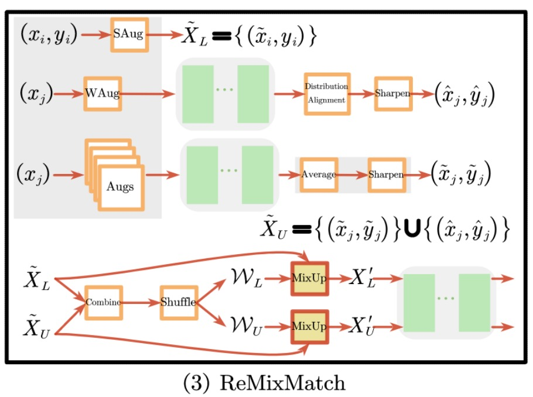

- **DivideMix**: Built to solve the problem of learning with noisy labels. Uses the co-divide method, which trains two models simultaneously. For each one, a *Gauss Mixed Model* is fitted on the loss distribution of each sample to divide into X_l and X_u. These are then used to train the next epoch

- **FixMatch**: Creates several weak augmentations from a datapoint x_u, and predicts a pseudo-label y^_u. A model is trained with these datapoints and predicts pseudo-labels for the strong augmentation of x_u
Weak augmentations are himage flipping horizontally or vertically, or translating them by up to 12.5% vertically or horizontally. RandAugment and CTAugment are strong augmentation functions.

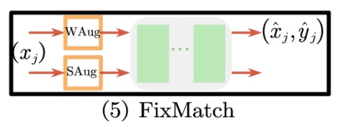
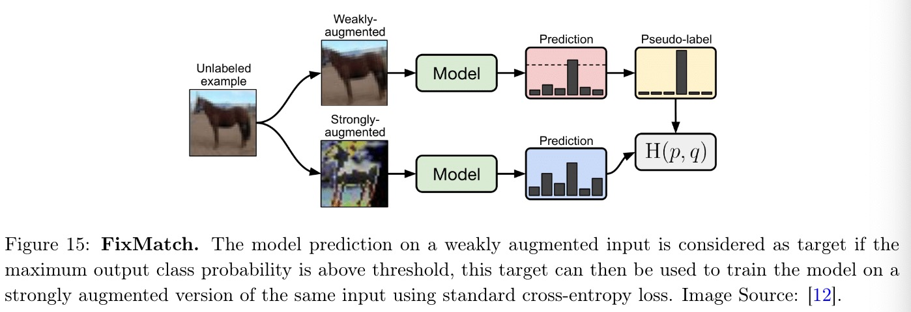

Summary of techniques that can be used to increase performance.

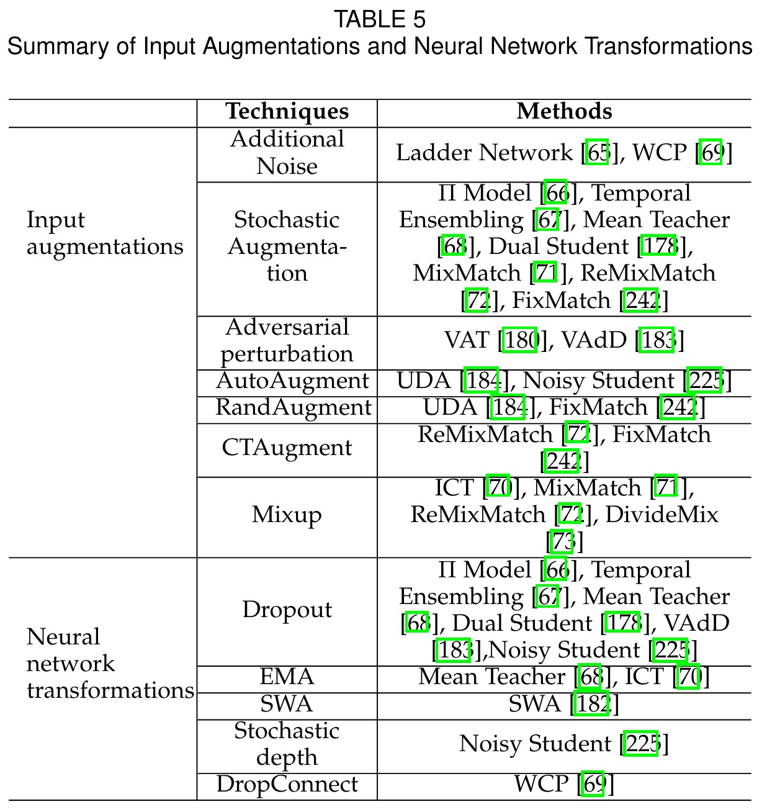

## Evaluating SSL Approaches

According to some articles, some procedures must be followed in order to evaluate SSL methods.

- **Shared implementation**: To compare SSL models, they must possess the same parameters/configurations, like hyperparameters, parameter initialization, data augmentation, regularization, etc...

- **High-quality supervised baseline**: The main objective of a SSL model is to overcome SL approaches. Therefore, there must always be a supervised model implemented with many different configurations, to ensure that the SSL model is better.

- **Comparison to transfer learning**: Train the SSL model in an extensive labeled dataset, and then re-train on a smaller labeled dataset. 

- **Considering class distribuition mismatch** Even though they are unlabeled, there should be an even number of classes.

- **Varying the amount of labeled and unlabeled data**: Compute the algorithm with several syzed variations of X_u.

- **Realistically small validation sets**: When the test/validation set is significantly larger than the training set, to avoid overfiting, test the model in subsets of the test data.

## Problems with SSL

- **Theoretical analysis**. All unlabeled instances are equally weighted, however they do not share the same importance.

- **Incorporation of domain knowledge**. All these models have data assumptions, which theoretically are feasible, but in practice they are hard to evaluate. The distibution of the datasets are unknown. When the assumptions do not meet reality, adding unlabeled data only worsens the model's performance.

- **Imbalanced SSL**. Datasets are naturally imbalanced, and SSL models assume its balance. Therefore, their perfomance is normally biased to the most frequent class.

- **Robust semi-supervised learning**. The application of consistency training on augmented unlabeled data without affecting the model's performance.

- **Safe semi-supervised learning**. Some empirical studies have shown that adding unlabeled data might reduce the model's performance, thus it is crucial to insist on safe SSL approaches.
